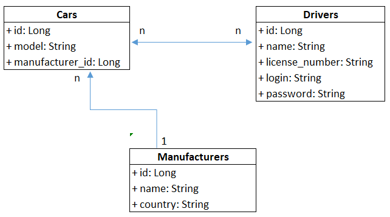

# Taxi-Service
## Project description:
A simple web application for taxi service,
the maim purpose of which is to register all drivers
and cars of the fleet. The program is written in Java,
so it will work stably on any platform Windows, Linux or Mac.
The program is written according to the principles of SOLID 
and has a 3-tier architecture: controllers, Service, DAO. 
## Features:
- registration like a driver;
- authentication like a driver;
- create/update/remove a manufacturer;
- create/update/remove a car;
- create/update/remove a driver;
- display list of all manufacturers;
- display list of all cars;
- display list of all drivers;
- display list of all cars by current driver;
- add driver to car.
## Project structure(3-layer architecture):
- DAO - Data access layer
- Service - Application logic layer
- Controllers - Presentation layer
## User technologies and libraries:
- Java 11
- Git
- Apache Tomcat
- Apache Log4j-core
- MySQL
- JDBC
- Javax Servlet
- JSP
- JSTL
- HTML/CSS
- Checkstyle plugin
- Project Lombok
## Steps to run the program on your computer:
- create a project fork in your repository
- clone the project locally
- create a separate branch
- replace stubs with real values in ConnectionUtil file
- configure Tomcat
- create the appropriate tables in the database (use the file 'init_db.sql' from the package 'resources')
- start a project
##  View of the main web page:

 
## Database UML diagram:
